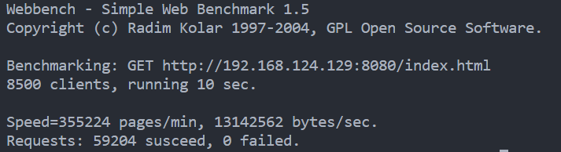

### WEB SERVER 2.0
Based on more mordern C++

#### Features
1. 使用Epoll I/O多路复用技术实现高并发的Reactor模型
2. 使用Epoll ET边缘触发模式，实现了非阻塞，高并发的通信，提高了服务器的吞吐量和响应速度
3. 使用线程池并发处理HTTP请求和响应
4. 使用std::vector封装char，实现动态增长的读写缓冲区
5. 使用C++11 std::atomic，避免data race

#### 压力测试
使用webbench测试，QPS可达接近10000

#### TODO
- 实现计时器，关闭长时间未响应的链接
- 实现POST请求解析
- 实现支持路由绑定的对外接口